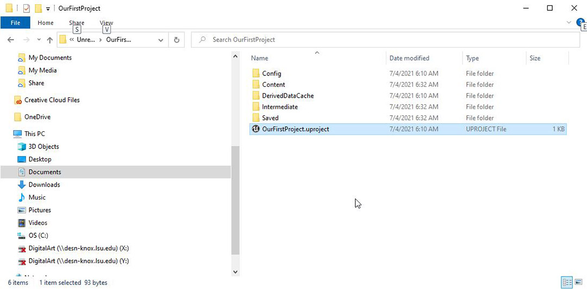
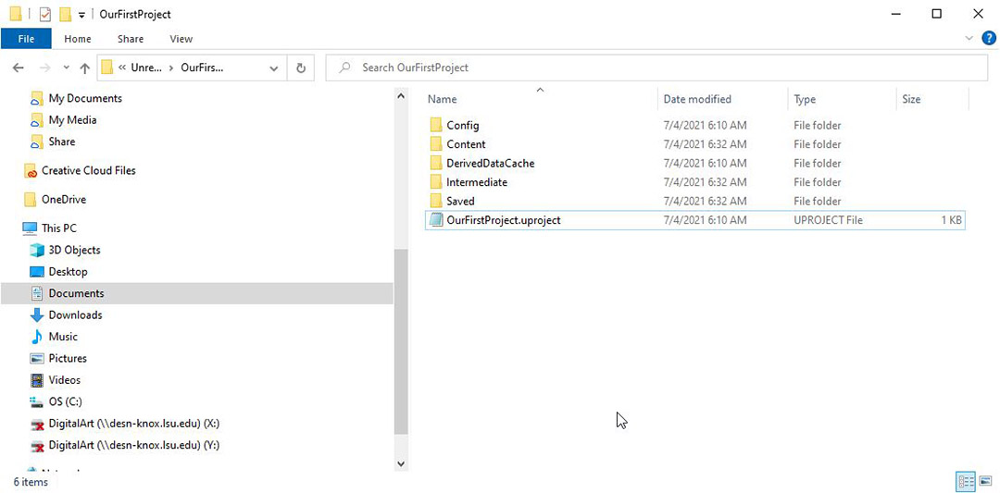
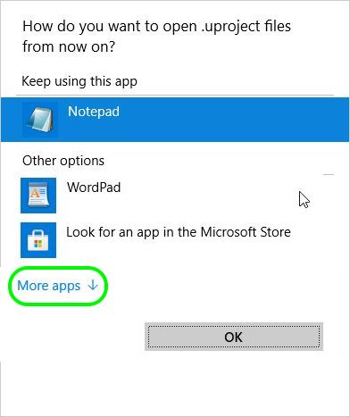
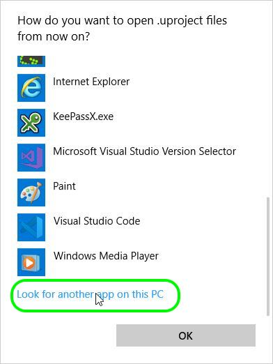
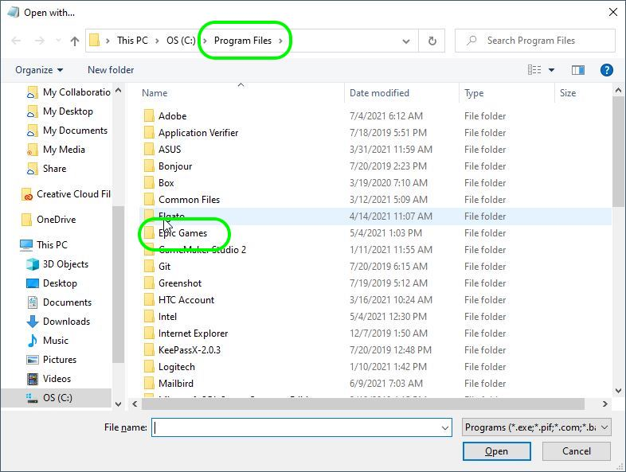
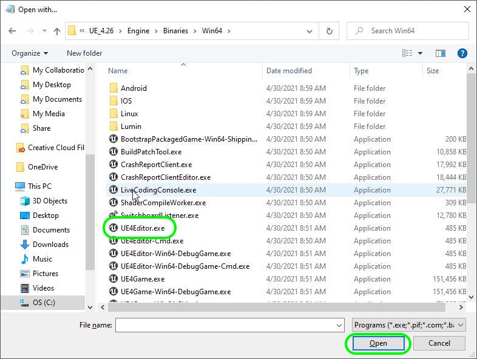
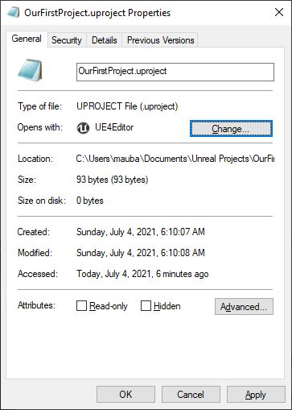
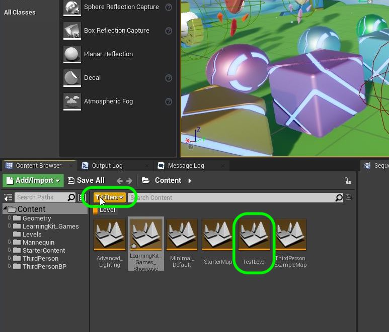
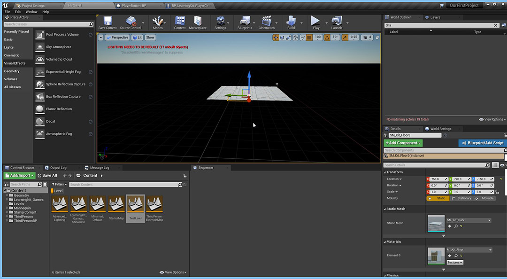

### First Hour in UE4

[home](../README.md#user-content-ue4-hello-world) • [next](#)

This is a follow up to the introductory Unreal tutorial *Your First Hour in Unreal Engine 4* that will put more of the basics into practice. twist on the usual **Hello World** tutorial which is printing words to a console to introduce someone to a new language.  Since Unreal Engine 4 combines logic, 3-D graphics and a sophisticated editor - this is a multi-disciplinary exercise.  This just introduces creating and importing a 3-D assets, creating a material and material instance and creating logic for a revolving camera. This will give you a start so that you can create your own unique version like the one below.

 

---

| `required.software`\|`Hello World`| 
| :--- |
| :floppy_disk: &nbsp;&nbsp;You will need to install the latest version of _UE4 4.26.x_ by downloading the [Epic Games Launcher](https://www.epicgames.com/store/en-US/download). You will also need a [GitHub](https://github.com/) account which is free to sign up for as we will be using version control. You will also need a **Mac** or **PC** that is powerful enough to run **Unreal**. If you are on a PC you will have to download and install [git](https://git-scm.com/downloads) (on a mac it may prompt you to install git as well but you can do it through the terminal). For those who don't like command line, will also install [Github Desktop](https://desktop.github.com) as it provides a GUI interface so you don't have to worry about remembering all the git syntax. Once git is installed you will also need to download and install the [Git LFS (Large File System)](https://git-lfs.github.com) as well for both PC and mac.  For this simple introduction that is all that is needed. |

---

##### `Step 1.`\|`FHIU`|:small_blue_diamond:

Complete the [Your First Hour in Unreal Engine 4](https://www.unrealengine.com/en-US/onlinelearning-courses/your-first-hour-in-unreal-engine-4) tutorial. For the **Building you Fist Level** module we will be taking on from here.  You do not need to do anything else beyond building the floor as shown in the video.

##### `Step 2.`\|`FHIU`|:small_blue_diamond: :small_blue_diamond: 

Now that you have finished the tutorial, there is one additional piece of information I would like to add.  I prefer to use the native **File Explorer** in both mac & pc's to launch my projects.  This way if I have multiple versions of the same project I know exactly which one I am working on.  Going through their interface abstracts the location and I have seen people save it to a cloud service, or a duplicate version somewhere else on their hard drive.  Navigate to where you have the stored the **Our First Project** folder.  Look for the *.uproject* file with the project name `OurFirstProject`.  If it has the **Unreal** logo you can double click on it and it will load. If you are on a mac this should be setup from default.  In **Windows 10** it often is not setup. If you can load the uproject succesfully you can skip to [step 8](#user-content-step-8fhiu-small_orange_diamond-small_blue_diamond-small_blue_diamond-small_blue_diamond)

##### `Step 3.`\|`FHIU`|:small_blue_diamond: :small_blue_diamond: :small_blue_diamond:

If you do not see the Unreal letter in the icon, the PC is not configured to load the project. You need to <kbd>RMB</kbd><kbd>Open With</kbd>. If **UE 4 Editor** shows up select it and go to [step 7](#user-content-step-7fhiu-small_orange_diamond-small_blue_diamond-small_blue_diamond). If not [go to step 4](#user-content-step-4fhiusmall_blue_diamond-small_blue_diamond-small_blue_diamond-small_blue_diamond).

##### `Step 4.`\|`FHIU`|:small_blue_diamond: :small_blue_diamond: :small_blue_diamond: :small_blue_diamond:

Click on the `More Apps` link and we will locate it manually.

##### `Step 5.`\|`FHIU`| :small_orange_diamond:
 
Scroll to the bottom and select the `Look for another app on this PC` link.

##### `Step 6.`\|`FHIU`| :small_orange_diamond: :small_blue_diamond:

Now locate the folder where you installed this version of Unreal.  By default it will be in `Program Files | Epic Games | UE_4.2X | Engine | Binaries | Win64 | ` and look for the `UE4Editor.exe` and select the <kbd>Open</kbd> button.  This links the Unreal Editor to the`.uproject` file type.  This way when you double click any `.uproject` file it should load it in editor like you want!

##### `Step 7.`\|`FHIU`| :small_orange_diamond: :small_blue_diamond: :small_blue_diamond:

Now you should be able to <kbd>RMB</kbd> and select the <kbd>Properties</kbd> button. If you see that it opens with Unreal engine it will work from now on with any new project moving forward!

##### `Step 8.`\|`FHIU`| :small_orange_diamond: :small_blue_diamond: :small_blue_diamond: :small_blue_diamond:

Lets now go back to the test level.  Go to **Content Browser** and press the <kbd>Filters</kbd> dropdown and select `Level`.  Double click the **TestLevel** (empty level you created in the above walk through with just a floor and atmosphere.

##### `Step 9.`\|`FHIU`| :small_orange_diamond: :small_blue_diamond: :small_blue_diamond: :small_blue_diamond: :small_blue_diamond:

Now you should see a level that looks like this:

| [home](../README.md#user-content-ue4-hello-world) | [next](#)|
|---|---|
