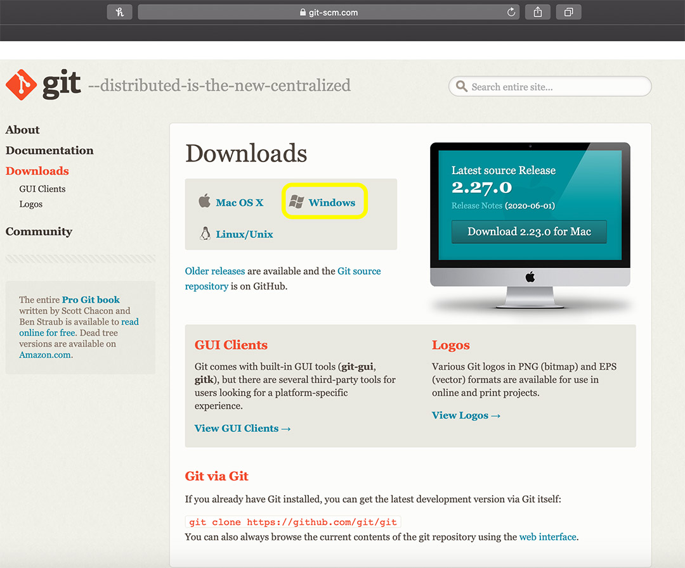
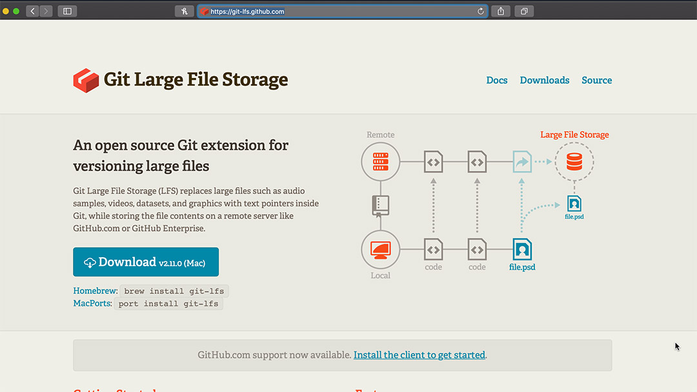
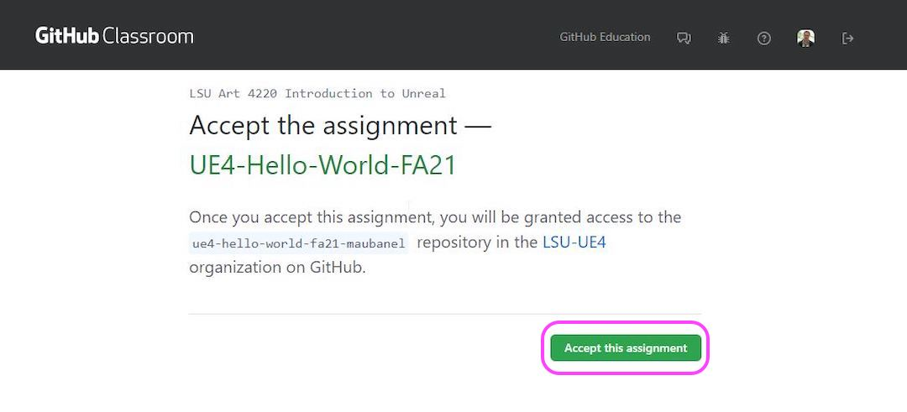
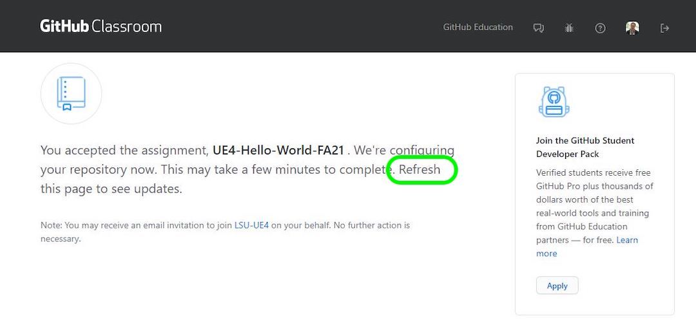
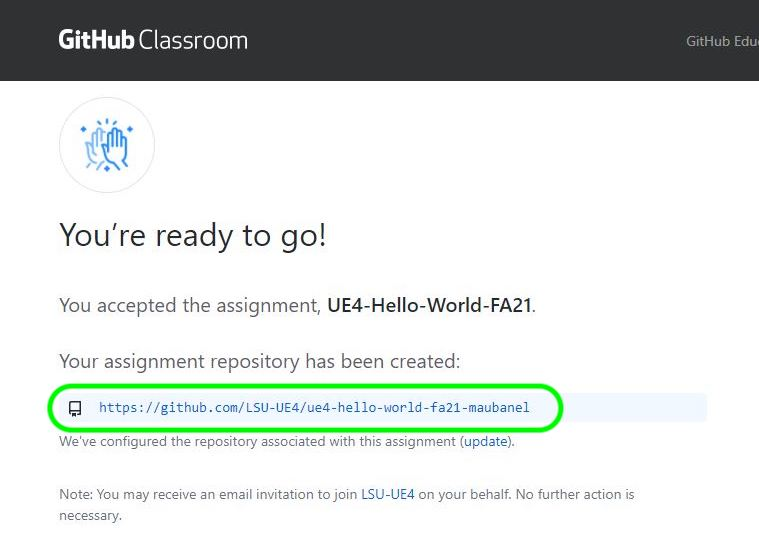

### Setting Up Unreal & Github

[previous](../first-hour/README.md#user-content-first-hour-in-ue4) • [home](../README.md#user-content-ue4-hello-world) • [next](#)

Before we can start we want to set up our development environment. This includes setting up **GitHub** as our version control so we can backup and maintain our project safely. Make sure you have lots of hard drive space as the engine and various downloads can take a lot of room. I recommend around 100 gigabytes free would be suitable.

 

---

| `important.concept`\|`Version Control`| 
| :--- |
| There are some potential problems developing with a complex engine: 
:small_blue_diamond: The engine can crash and you can lose your work 
:small_blue_diamond: You can forget the data on another computer 
:small_blue_diamond: Your hard drive can die and all the data can be lost 
All of these problems can be avoided if we use **version control** to back up our data.  This way we can recover lost work, *clone* the data on another computer and collaborate as a team.  It is a good idea to get used to using version control as all large projects use them. The good news is that you have the tools integrated right in Unreal. |

---

##### `Step 1.`\|`SUU&G`|:small_blue_diamond:

If you are on a mac git comes ready to go (it might need to install xcode when first running the command).  On a PC you will need to install [git](https://git-scm.com/downloads).  Double click and keep all the default suggestions.  Follow the directions on the website for installing it on PC.

##### `Step 2.`\|`FHIU`|:small_blue_diamond: :small_blue_diamond: 

Now so you don't have to use command line prompts for git it is a good idea to install a GUI and the one I like best is [Github Desktop](https://desktop.github.com) as it integrates with GitHub perfectly.  Download and install the software.

##### `Step 3.`\|`SUU&G`|:small_blue_diamond: :small_blue_diamond: :small_blue_diamond:

Now since game projects can get very large and graphics, and 3-D models can take a lot of space it is best to use the [Git LFSn (Large File System)](https://git-lfs.github.com) extension for games.  This way only assets that are currently being used are downloaded to your system speeding up your workflow and allowing you to hold larger files in GitHub. Install it on your computers per the directions on the website.

##### `Step 4.`\|`SUU&G`|:small_blue_diamond: :small_blue_diamond: :small_blue_diamond: :small_blue_diamond:

In the editor select the **Edit** menu item then from the drop down menu select **Editor Preferences**. Select **Loading & Saving** tab from the left hand side.  Go to *Source Control* and set **Prompt for Checkout on Asset Modification** to `true` and **Add New Files when Modified** to `true`.  Leave the other two settings at `false` and accept their default editor to deal with merge conflicts. 

https://user-images.githubusercontent.com/5504953/124603352-b3b06880-de1e-11eb-926e-a913b741c38b.mp4

##### `Step 5.`\|`SUU&G`| :small_orange_diamond:

Make sure you have a **GitHub** account and that you are logged into it.  Click on [GitHub Classroom Hello World Link](https://classroom.github.com/a/z7lsXBo4).  Accept the prompt if it asks you go join the class and you should get to a **Accept the Assignment – UE4-Hello-World-FA21**.  Press the <kbd>Accept this assignment</kbd> button.

##### `Step 6.`\|`SUU&G`| :small_orange_diamond: :small_blue_diamond:

You will get a message saying the repository is geing setup.  Refresh/Reload your web browser as instructed.

##### `Step 7.`\|`SUU&G`| :small_orange_diamond: :small_blue_diamond: :small_blue_diamond:

Eventually you will get a link for the repository.  Click on this link:

##### `Step 8.`\|`SUU&G`| :small_orange_diamond: :small_blue_diamond: :small_blue_diamond: :small_blue_diamond:

Now our server has no files on it.

##### `Step 9.`\|`SUU&G`| :small_orange_diamond: :small_blue_diamond: :small_blue_diamond: :small_blue_diamond: :small_blue_diamond:

| [previous](../first-hour/README.md#user-content-first-hour-in-ue4)| [home](../README.md#user-content-ue4-hello-world) | [next](#)|
|---|---|---|
